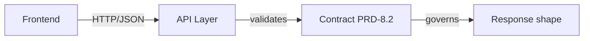
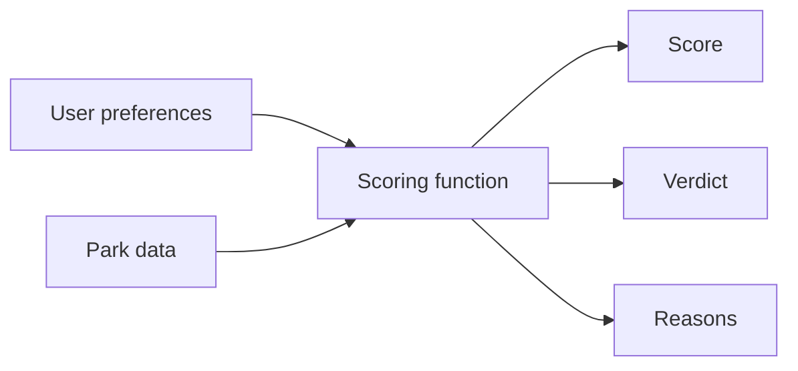
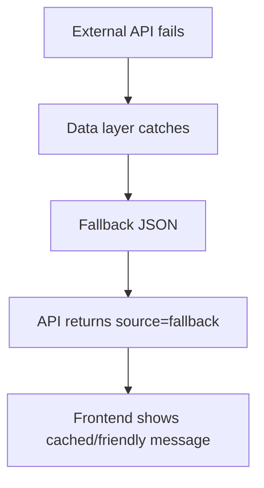
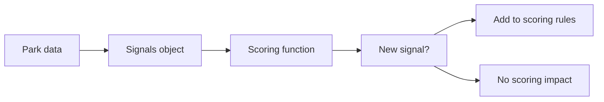
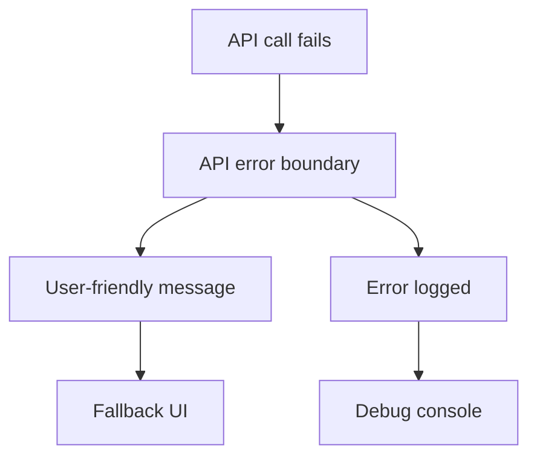
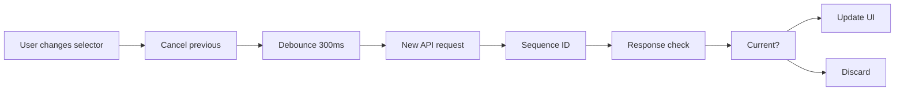
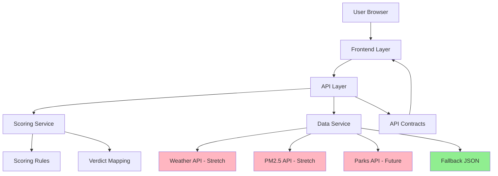
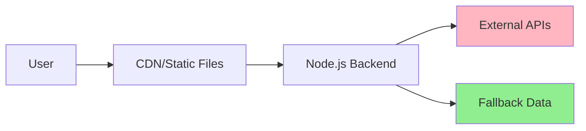

# Architecture Spine — WeekendWhere SG

## Design Paradigm

**Layered architecture** with clear separation of concerns. Frontend (presentation) → API Layer (contracts) → Business Logic (scoring) → Data Layer (sources). Enables independent frontend/backend development for the training demo while maintaining clear extension points for future features.

## Invariants & Rules

### AD-1 — API Contract Ownership

- **Binds:** FR-8.1, FR-8.2, all frontend/backend communication
- **Prevents:** Frontend and backend assuming different data structures or response formats
- **Rule:** API response shape defined in PRD (FR-8.2) is the only shared truth. Frontend never assumes backend implementation details. Backend never assumes frontend UI structure. Any change to response shape requires updating API contract first.



### AD-2 — Scoring Logic Isolation

- **Binds:** FR-2.1, FR-2.2, FR-2.3, FR-3.3, all scoring behavior
- **Prevents:** Scoring rules scattered across multiple files or coupled to data fetching
- **Rule:** Scoring is a pure function: `(parkData, userPreferences) => {score, verdict, reasons}`. No external dependencies. No side effects. Easy to test. Easy to modify. Same function works for fallback data and live data.



### AD-3 — Graceful Degradation Hierarchy

- **Binds:** FR-3.1, FR-3.2, FR-3.3, FR-8.3, all external data dependencies
- **Prevents:** External API failures breaking the entire application
- **Rule:** Each layer has fallback. Data layer → fallback JSON. API layer → error response with source="fallback". Frontend → cached results or user-friendly message. No technical errors visible to end users.



### AD-4 — State Mutation Boundaries

- **Binds:** All UI state, selector state, loading state
- **Prevents:** State mutations happening in unpredictable locations or timing issues
- **Rule:** Frontend owns all UI state. Backend is stateless. Only state mutation path: user action → UI state update → debounced API call → response → UI state update. No backend sessions. No hidden state.

### AD-5 — Signal-Based Extensibility

- **Binds:** FR-4.3, FR-5.3, all future signal additions
- **Prevents:** Adding new features requiring breaking changes to existing code
- **Rule:** Parks carry signals object `{activity, family, cycling, nature, fitness, route, kidFriendly}`. Scoring reads signals. Adding new signal never breaks existing scoring. Frontend ignores unknown signals. Data sources populate signals they know.



### AD-6 — Error Boundary Architecture

- **Binds:** FR-7.2 (error states), FR-8.3 (graceful degradation), all frontend error handling
- **Prevents:** Unhandled errors crashing the entire UI or exposing technical details to users
- **Rule:** Frontend implements error boundaries at route and component level. API errors caught at call site, never propagate to render. Fallback UI shown for each error boundary. Technical errors never visible to end users. Error boundaries logged for debugging.



### AD-7 — Race Condition Handling

- **Binds:** FR-7.3 (interactive filter updates), AD-4 (state mutation), all rapid user interactions
- **Prevents:** Rapid selector changes causing inconsistent UI state or API response mismatches
- **Rule:** Selector changes trigger request cancellation. Only one API request active at a time. Debounced requests carry sequence IDs. Out-of-order responses discarded. Loading state reflects current request, not previous. State updates atomic via Svelte store batched updates.



### AD-8 — Cache Invariants

- **Binds:** Performance NFR (<2s API response), data efficiency goals, external API rate limits
- **Prevents:** Stale data served as fresh, excessive API calls, cache thrashing
- **Rule:** API responses cached for 5 minutes TTL. Cache key includes region+activity+preference. Explicit cache invalidation on data source updates. Fallback data never expires. Conditional requests (If-None-Match) for external APIs. Cache headers respected. Bypass cache on user force-refresh.

```mermaid
graph TD
    A[API request] --> B{Cache key lookup}
    B --> C[Hit & TTL valid?]
    C --> D[Return cached]
    C --> E[Miss or TTL expired?]
    E --> F[Fetch from API]
    F --> G[Store in cache]
    G --> H[Return response]
    D --> I[Set cache header]
    H --> I

## Consistency Conventions

| Concern | Convention |
| --- | --- |
| **Naming (entities)** | Park IDs: kebab-case (`east-coast-park`). API endpoints: kebab-case (`/api/recommendations`). Frontend functions: camelCase. Backend functions: camelCase. |
| **Naming (files)** | Frontend: `ComponentName.js`. Backend: `featureName.service.js`. Tests: `ComponentName.test.js`. |
| **Data & formats (IDs)** | Park IDs are stable strings. Never expose database auto-increment IDs. |
| **Data & formats (dates)** | ISO 8601 strings (`2026-06-27`). API returns dates only when needed. |
| **Data & formats (errors)** | API errors return `{error: {message, code, details}}`. Frontend shows `error.message` only. |
| **Data & formats (envelopes)** | API response envelope defined in FR-8.2: `{source, region, activity, preference, count, recommendations}`. |
| **State & cross-cutting (mutation)** | Frontend: single state object, updates via `setState` pattern. Backend: no mutation, pure functions. |
| **State & cross-cutting (errors)** | Frontend: `try/catch` around API calls, show user-friendly message. Backend: `try/catch` around data sources, return fallback. |
| **State & cross-cutting (logging)** | Backend: structured logging with levels. Frontend: console logging only in development. |
| **State & cross-cutting (config)** | Environment variables for sensitive data. Feature flags for experimental features. |

## Stack

| Name | Version |
| --- | --- |
| Node.js | 20.x LTS |
| TypeScript | 5.x |
| Backend Framework | Express 4.x |
| Frontend Framework | Svelte 4.x |
| Component Library | shadcn-svelte (latest) |
| Monorepo Tool | Turborepo (latest) |
| Package Manager | pnpm (latest) |
| Build Tool | Vite (via SvelteKit) |
| Styling | Tailwind CSS (via shadcn-svelte) |
| Hosting | Vercel (frontend + API) or Railway |
| Data (fallback) | Static JSON file |
| Data (future) | data.gov.sg APIs (weather, PM2.5, parks) |

## Structural Seed

```text
weekend_where_sg/
├── apps/
│   ├── web/                   # SvelteKit frontend app
│   │   ├── src/
│   │   │   ├── lib/
│   │   │   │   ├── components/    # Svelte components
│   │   │   │   ├── stores/        # Svelte stores for state
│   │   │   │   ├── api/           # API client functions
│   │   │   │   └── types/         # TypeScript types
│   │   │   ├── routes/            # SvelteKit routes
│   │   │   └── app.html          # Root layout
│   │   ├── static/               # Static assets
│   │   ├── vite.config.ts
│   │   └── svelte.config.js
│   │
│   └── api/                   # Express backend API
│       ├── src/
│       │   ├── routes/
│       │   │   ├── health.ts          # FR-8.1: health endpoint
│       │   │   └── recommendations.ts # FR-8.2: recommendations endpoint
│       │   ├── services/
│       │   │   ├── scoring.ts         # AD-2: pure scoring function
│       │   │   ├── data.ts            # AD-3: data source abstraction
│       │   │   └── fallback.ts        # FR-8.3: fallback data
│       │   ├── utils/
│       │   │   └── errors.ts          # Error handling utilities
│       │   └── server.ts              # Express server setup
│       └── data/
│           └── parks.json             # Fallback park data
│
├── packages/
│   ├── ui/                    # Shared shadcn-svelte components
│   │   ├── src/
│   │   │   ├── components/        # Reusable UI components
│   │   │   │   ├── button/
│   │   │   │   ├── card/
│   │   │   │   ├── select/
│   │   │   │   └── badge/
│   │   │   └── index.ts
│   │   └── package.json
│   │
│   ├── config/                # Shared tooling configs
│   │   ├── tsconfig.json          # Shared TypeScript config
│   │   ├── tailwind.config.js     # Shared Tailwind config
│   │   └── eslint.config.js      # Shared ESLint config
│   │
│   └── types/                 # Shared TypeScript types
│       ├── src/
│       │   ├── park.ts              # Park data types
│       │   ├── recommendation.ts    # Recommendation types
│       │   ├── api.ts               # API request/response types
│       │   └── index.ts
│       └── package.json
│
├── turbo.json               # Turborepo configuration
├── pnpm-workspace.yaml      # pnpm workspace configuration
├── package.json             # Root package.json
└── tsconfig.json            # Root TypeScript config
```

## Capability → Architecture Map

| Capability / Area | Lives in | Governed by |
| --- | --- | --- |
| FR-1.1, FR-1.2, FR-1.3 (Selectors, Recommendations) | Frontend (`js/app.js`, `js/ui.js`) | AD-1 (API Contract), AD-7 (Race Conditions) |
| FR-2.1, FR-2.2, FR-2.3 (Scoring Engine) | Backend (`services/scoring.js`) | AD-2 (Scoring Isolation) |
| FR-3.1, FR-3.2, FR-3.3 (Condition Awareness) | Backend (`services/data.js`) | AD-3 (Graceful Degradation), AD-8 (Cache Invariants) |
| FR-4.1, FR-4.2, FR-4.3 (Route Intelligence) | Backend (`services/scoring.js`) | AD-5 (Signal-Based Extensibility) |
| FR-5.1, FR-5.2, FR-5.3 (Family/Accessibility) | Backend (`services/scoring.js`) | AD-2 (Scoring Isolation) |
| FR-6.1, FR-6.2, FR-6.3 (Search/Location) | Backend (future `services/search.js`) | AD-5 (Signal-Based Extensibility) |
| FR-7.1, FR-7.2, FR-7.3 (Frontend Experience) | Frontend (`js/ui.js`, `css/styles.css`) | AD-1 (API Contract), AD-6 (Error Boundaries), AD-7 (Race Conditions) |
| FR-8.1, FR-8.2, FR-8.3 (Backend API) | Backend (`api/`) | AD-1 (API Contract), AD-3 (Graceful Degradation), AD-8 (Cache Invariants) |

## System Dependency Diagram



## Deployment Architecture



## Deferred

**Data Persistence:** MVP uses in-memory or file-based data. Database choice deferred until post-MVP when usage patterns are known.

**Authentication/Authorization:** No user accounts for MVP. Authentication approach deferred when personalization features are prioritized.

**Caching Strategy:** No explicit caching layer for MVP. Caching approach deferred when performance requirements emerge from real usage.

**Monitoring/Observability:** Basic logging for MVP. Full observability platform deferred when operational scale increases.

**CI/CD Pipeline:** Manual deployment for MVP. Automated deployment deferred when team size and release frequency increase.

**Testing Strategy:** Manual testing for MVP. Automated testing approach deferred when codebase stabilizes and maintenance cost increases.

**Internationalization:** Singapore English-only for MVP. i18n approach deferred when regional expansion is planned.

**Dark Mode:** Single theme for MVP. Dark mode deferred when UX patterns are established.

**Offline Support:** Online-required for MVP. Offline/deferred sync approach deferred when mobile usage patterns are understood.

**Real-time Updates:** Polling-based for MVP. WebSocket approach deferred when real-time conditions (weather, PM2.5) become critical.
